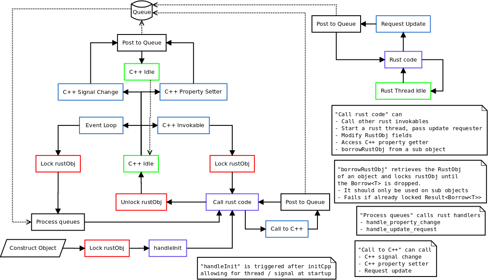

<!--
SPDX-FileCopyrightText: 2022 Klarälvdalens Datakonsult AB, a KDAB Group company <info@kdab.com>
SPDX-FileContributor: Andrew Hayzen <andrew.hayzen@kdab.com>

SPDX-License-Identifier: MIT OR Apache-2.0
-->

# Threading

## Concept

The general concept for threading is that when Rust code is being executed a lock has been acquired on the C++ side to prevent Rust code being executed from multiple threads.

This means that Rust code, such as invokables and handlers, which are directly called from C++ are executed on the Qt thread.

We provide a solution to prevent entering deadlocks from signal connections, eg if a property change signal was connected to an invokable on the C++/QML side this wouldn't be able to acquire a lock if the property change was triggered from a Rust invokable. The solution is to post events to a queue which could cause deadlocks, eg signal emisson, these are then executed once the next event loop occurs, and crucially, after the lock from the Rust invokable is released.

If Rust code needs to listen to property changes, handlers can be implemented (eg PropertyChangeHandler) in the [RustObj Handlers](../qobject/handlers.md). These are called directly in the event loop from the Qt thread.



## Multi threading

To achieve safe multi-threading on the Rust side we use an `UpdateRequester`. Where the Rust thread is started (eg in an invokable) the `UpdateRequester` should be cloned into the thread.

Then when the background thread needs to update a value in the Qt object it requests an update, this is posted into the same queue as above. Once the event loop occurs this calls `UpdateRequestHandler` in the [RustObj Handlers](../qobject/handlers.md) so that you can safely call setters or emit signals from the Qt thread and synchronise your state to the foreground.

We recommend using a channel in the thread to send enums or values which are then processed in `UpdateRequestHandler`.

Below is a complete Rust example of a multi-threaded object.

```rust,ignore,noplayground
{{#include ../../../examples/qml_with_threaded_logic/src/lib.rs:book_macro_code}}
```
