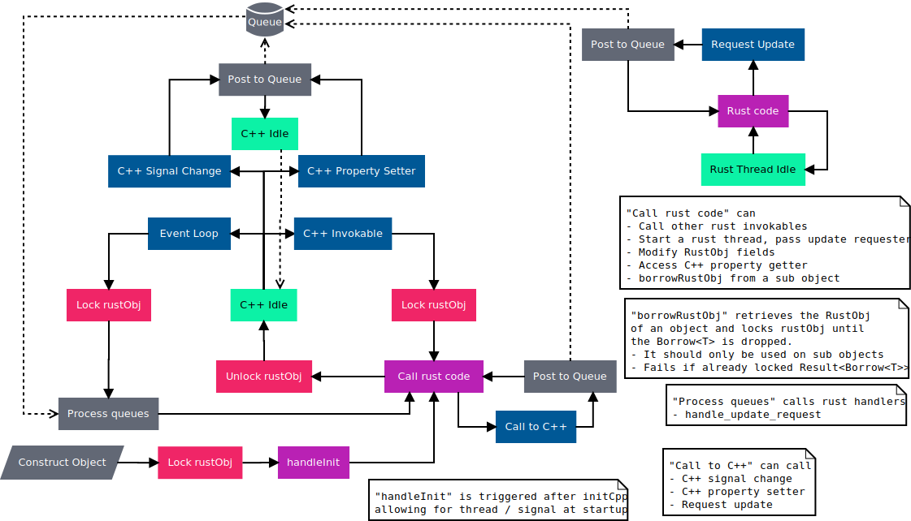

<!--
SPDX-FileCopyrightText: 2022 Klarälvdalens Datakonsult AB, a KDAB Group company <info@kdab.com>
SPDX-FileContributor: Andrew Hayzen <andrew.hayzen@kdab.com>

SPDX-License-Identifier: MIT OR Apache-2.0
-->

# Threading

## Concept

The general concept for threading is that when Rust code is being executed a lock has been acquired on the C++ side to prevent Rust code being executed from multiple threads.

This means that Rust code, such as invokables and handlers, which are directly called from C++ are executed on the Qt thread.

We provide a solution to prevent entering deadlocks from signal connections, eg if a property change signal was connected to an invokable on the C++/QML side this wouldn't be able to acquire a lock if the property change was triggered from a Rust invokable. The solution is to post events to a queue which could cause deadlocks, eg signal emisson, these are then executed once the next event loop occurs, and crucially, after the lock from the Rust invokable is released.

<div style="background-color: white; padding: 1rem; text-align: center;">



</div>

## Multi threading

To achieve safe multi-threading on the Rust side we use an [`CxxQtThread<T>`](../qobject/cxxqtthread.md).
A `CxxQtThread<T>` represents a reference to the Qt thread that the QObject of type `T` lives in.
When a new Rust thread is started (e.g. in an invokable) the `CxxQtThread<T>` can be moved into the thread to later update the QObject in a thread safe manner.

When the Rust thread needs to update a value in the QObject it can then queue a function pointer to the thread.
This function pointer will be executed on the thread the QObject lives in.
Updating the QObject is then thread-safe.

Below is a complete Rust example of a multi-threaded object.

```rust,ignore,noplayground
{{#include ../../../examples/qml_with_threaded_logic/rust/src/lib.rs:book_macro_code}}
```
