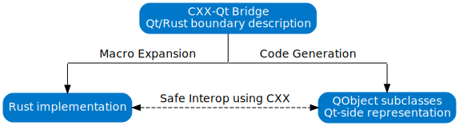

<!--
SPDX-FileCopyrightText: 2022 Klarälvdalens Datakonsult AB, a KDAB Group company <info@kdab.com>
SPDX-FileContributor: Leon Matthes <leon.matthes@kdab.com>

SPDX-License-Identifier: MIT OR Apache-2.0
-->

# QObjects in Rust

> The right tool for the right job.

> If you only have a hammer, every problem looks like a nail.

> Don't bring a knife to a gun fight.

There are many bits of advice like that.
With CXX-Qt, we aim to make it possible to use the right tool for each of the many jobs necessary to build a modern GUI application.

So what is in our toolbox for a typical Qt application?
- QML - A declarative, flexible, dynamically-typed, interpreted language that is purpose built to define reactive and beautiful GUI layouts and widgets with quick iteration speed.
- C++ - The traditional back-end of Qt - A fast, low-level language with a strong type system. C++ offers a rich ecosystem, many Qt-specific libraries and bare-metal performance. The cost when using C++ is that it is slow to develop, very error-prone and can easily lead to memory-issues, which can instantly crash your application and cause security issues.

Notably absent then is a back-end language that allows us to get rid of the issues C++ has and provides us with a safe way to write fast back-end code.
This of course is where Rust comes in.
Whilst Rust doesn't have quite as rich of an ecosystem, it is typically faster to develop than C++, with easy dependency management, and most importantly, safe memory access.
Therefore it is an ideal candidate to replace C++ for writing the back-end business-logic code that feeds the GUI with data.

However, C++ as well as QML still have their place in Qt applications.
For that reason Rust, C++, and QML should all be able to be used to complement each other.
CXX-Qt aims to make it easy to integrate all three languages with each other, through the use of Qt's [meta object system](https://doc.qt.io/qt-6/metaobjects.html) and [CXX](https://cxx.rs).

As CXX-Qt is largely an expansion on top of CXX, you should make yourself familiar with CXX first.
You can read their excellent documentation here:
> [https://cxx.rs/](https://cxx.rs)

CXX already provides idiomatic interaction between C++ and Rust, from Rust, as well as from C++.
CXX-Qt builds on this foundation, to allow you to define Qt-specific concepts in Rust.

These concepts include:
- Custom QObject classes
    - Properties
    - Invokables/Slots
    - Signals
- Enums

As with CXX, to use these features you mark a Rust module with an attribute macro ([`#[cxx_qt::bridge]`](../bridge/index.md)).
Inside this bridge, you then describe the bi-directional interface between your C++/Qt and Rust code.

CXX-Qt will then expand this Rust bridge into two separate parts:
- C++ files that define QObjects, enums etc. and expose them to [Qts meta-object-system](https://doc.qt.io/qt-6/metaobjects.html).
- The Rust code which provides the Rust implementation of the described structures, as well as interfaces to any C++/Qt constructs you declared.

## Rust structs as QObjects

Similar to CXX, CXX-Qt allows you to expose Rust structs as a new type to C++.
However, CXX-Qt expands this feature to allow you to create a new QObject subclass that is backed by a Rust struct.
In comparison to a normal opaque CXX class, the mapping between the QObject subclass and the Rust struct is **not 1:1**!

The QObject subclass it its own type in Rust, as well as in C++.
When such a QObject is instantiated, it will always also construct an instance of the Rust struct.
The QObject can then refer to the underlying Rust struct for property access.
Any behavior of this QObject subclass will also be defined in Rust, e.g. using the [`#[qinvokable]`](../bridge/extern_rustqt.html#invokables) attribute.
The Rust implementation also has access to the underlying Rust struct to modify any Rust data.
In comparison to most CXX types, the outer QObject class and the inner Rust struct will remain two distinct types!

But enough theory for now, lets jump in and write [our first CXX-Qt module](./2-our-first-cxx-qt-module.md).

