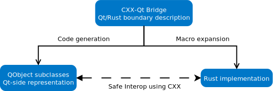

<!--
SPDX-FileCopyrightText: 2021 Klarälvdalens Datakonsult AB, a KDAB Group company <info@kdab.com>
SPDX-FileContributor: Andrew Hayzen <andrew.hayzen@kdab.com>

SPDX-License-Identifier: MIT OR Apache-2.0
-->

# CXX-Qt - Safe interop between Rust and Qt

This library provides a safe mechanism for bridging between Qt code and Rust code in a different way to typical Rust Qt bindings.

We acknowledge that Qt code and Rust code have different idioms so cannot be directly wrap from one to another.

Instead of one-to-one bindings we use [CXX](https://cxx.rs/) to [bridge](./concepts/bridge.md) between, this allows for normal Qt code and normal Rust code.

We feel this is more powerful than typical bindings as this allows us to provide a safe API and safe [multi-threading](./concepts/threading.md) between Qt and Rust.

To aid integration of Qt and Rust code we provide common [Qt types](./concepts/types.md) for Rust which can pass across the bridge and provide ways to express common [Qt idioms](./concepts/qt.md).

Through the use of macros and code generation as seen in the figure below, the developer describes a `QObject` with CXX-Qt macro annotations. Then CXX-Qt generates the C++ representation of the object and uses macro expansion to define the [CXX](https://cxx.rs/) bridge for the interop between C++ and Rust.

