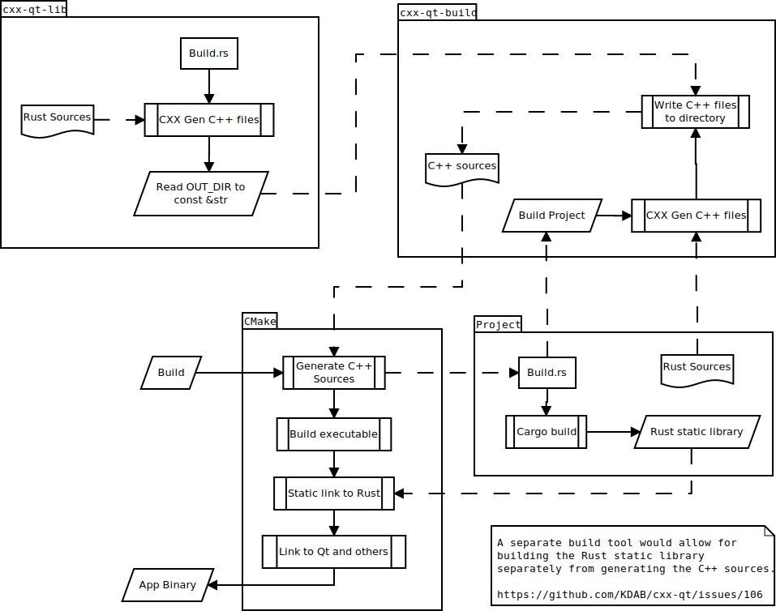

<!--
SPDX-FileCopyrightText: 2022 Klarälvdalens Datakonsult AB, a KDAB Group company <info@kdab.com>
SPDX-FileContributor: Andrew Hayzen <andrew.hayzen@kdab.com>

SPDX-License-Identifier: MIT OR Apache-2.0
-->

# Build

The process of building a CXX-Qt project internally is complex and contains multiple stages.

  1. CMake build is started, and triggers cargo build
  2. CXX-Qt build generates C++ sources and static library
  3. CMake builds the project C++ sources combined with generated sources
  4. CMake links the target to the Rust static library and Qt

## 1. Cargo build

When cargo build is triggered, this causes dependencies to be downloaded and built. One of these is
`cxx-qt-lib` which defines helper Qt types. It contains a `build.rs` which uses CXX to generate C++
sources for the Qt types. These are stored into the `OUT_DIR` of the crate.
Note that we cannot know where the `OUT_DIR` or other files of `cxx-qt-lib` are, from the main
project, as they are in hashed directories. Therefore as `cxx-qt-lib` is built it uses `include_str!`
to expose the generates files as `const` strings in the crate.

Next cargo triggers the `build.rs` of the main project, which executes `cxx-qt-build` helper methods.

## 2. CXX-Qt build

Firstly `cxx-qt-build` uses CXX to generate C++ sources for the project's Rust source files into a
well known location for CMake (`target/cxx-qt-gen/`).

Then `cxx-qt-build` writes any static headers (such as CXX headers) and `QQmlExtensionPlugin`
generated code to the same folder.

Next it uses the `const` strings from `cxx-qt-lib` to write the C++ source files into a well known
location for CMake (`target/cxx-qt-lib/`).

Finally it writes a list of the generated C++ sources into a `cpp_sources.txt` file in the
`cxx-qt-gen` folder.

Cargo now continues building the Rust project as normal, expanding macros and creating a static library.

## 3. CMake build

Now that Rust has completed, CMake reads the generated C++ sources and combines these with the projects
C++ sources (any QML resources are also added at this stage).

This results in an executable target within CMake.

## 4. CMake link

Now that we have an executable target, we first link the target to the Rust static library from
cargo. Then we link any external libraries, eg for threading, and then finally link to Qt.

This then results in CMake producing a binary which has Rust combined with the C++ application.

## Future

In the future there are multiple improvements that we could like to make to the CMake build process.

  * Split the CXX generation and Rust build into separate stages. Currently the configure stage of
    CMake causes Rust to build. Instead create a CLI tool which simply generates C++ sources
    for given Rust sources and writes them to a given location. Then this can be used to generate
    the C++ sources and a normal cargo build can be used in the CMake build phase later
    [https://github.com/KDAB/cxx-qt/issues/106](https://github.com/KDAB/cxx-qt/issues/106)
     * How will CMake know which Rust files to parse? It would be best if we can point it to a
       manifest and it could detect the Rust source files.
     * What phase of the process will write the `cxx-qt-lib` files?
  * Detect which libraries need linking from dependent crates. Eg if your Rust plugin uses diesel
    with the sqlite implementation, you need the final CMake target to link against
    [https://github.com/KDAB/cxx-qt/issues/29](https://github.com/KDAB/cxx-qt/issues/29)
  * Avoid collisions in naming in both the C++ includes
    [https://github.com/KDAB/cxx-qt/issues/18](https://github.com/KDAB/cxx-qt/issues/19)
  * Consider if we can expose generated sources in a way with works with Cargo workspaces.
    At the moment multiple projects will collide with `target/cxx-qt-*`
    [https://github.com/KDAB/cxx-qt/pull/84](https://github.com/KDAB/cxx-qt/pull/84)

## Diagram

An abstract diagram of the current flow can be seen below.

